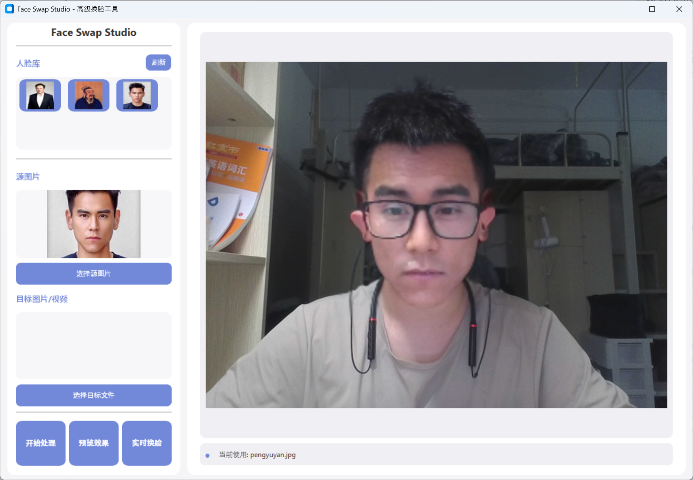

# Face Swap Studio - 基于Roop的高级换脸工具



**[👆 点击此处下载观看完整演示视频](preview.mp4)**

## 项目简介

Face Swap Studio是一个基于[Roop项目](https://github.com/s0md3v/roop)的高级换脸工具，通过全面改进用户界面和功能扩展，为用户提供更加便捷、高效的换脸体验。我们保留了Roop强大的换脸核心技术，同时大幅优化了操作流程和用户体验。

> 本项目仅用于学习、研究AI换脸技术，请勿用于非法用途。使用他人肖像时请确保获得授权。

## 主要优势

- **全新现代化界面**：采用CustomTkinter框架重构UI，支持深色/浅色主题
- **人脸库管理**：支持快速浏览和切换多个人脸源，无需重复导入
- **实时换脸功能**：支持摄像头实时预览，动态切换源人脸
- **简化操作流程**：优化设置项，提供直观的操作体验
- **优化视觉反馈**：状态提示更加清晰，支持进度展示
- **性能优化**：改进资源利用，提升处理速度

## 功能亮点

### 1. 人脸库功能

- 自动扫描`faces`目录下的所有人脸图片
- 支持jpg、png、jpeg和webp等多种格式
- 缩略图预览，一键切换源人脸
- 动态刷新，支持实时添加新人脸

### 2. 实时换脸

- 摄像头实时预览和换脸
- 无需停止即可切换不同源人脸
- 高清预览(800x600)，流畅渲染
- 实时状态反馈

### 3. 界面优化

- 分区明确的左右布局设计
- 圆角元素和柔和配色
- 响应式设计，自适应不同分辨率
- 清晰的视觉层次和状态提示

## 快速开始

1. 安装依赖
```
pip install -r requirements.txt
```

2. 运行程序
```
python run.py
```

3. 将源人脸图片放入`faces`目录
4. 选择源人脸和目标图片/视频
5. 点击"开始处理"或"实时换脸"

## 技术细节

Face Swap Studio基于Roop项目的核心技术，使用深度学习模型进行高质量人脸替换：

- 采用insightface进行人脸检测和特征提取
- 可选使用GFPGAN进行人脸增强
- 支持GPU加速处理
- 支持多种视频编码器

## 后续规划

1. 人脸库高级管理功能
2. 批量处理支持
3. 更多人脸美化选项
4. 视频处理进度可视化
5. 多摄像头支持
6. 实时滤镜效果
7. 预设值保存功能
8. 直播推流集成

## 致谢

- [Roop项目](https://github.com/s0md3v/roop)提供的原始代码和创意
- [insightface](https://github.com/deepinsight/insightface)提供的高质量人脸识别库
- 所有为原项目和相关库做出贡献的开发者

## 免责声明

本软件仅供学习和研究AI技术使用，不得用于非法用途。用户应遵守当地法律法规，在使用真实人脸时获得授权并在分享时明确标注为AI生成内容。开发者不对用户行为负责。

---

**原Roop项目文档**

有关原始Roop项目的详细信息，请访问[Roop GitHub](https://github.com/s0md3v/roop)。
